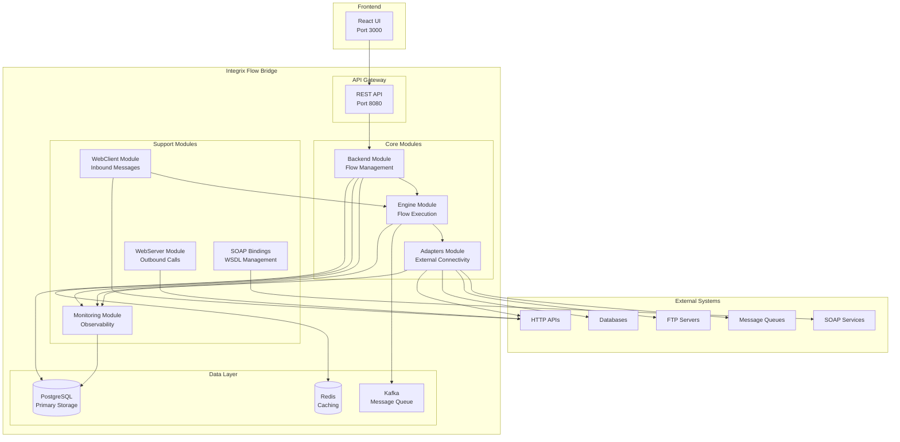
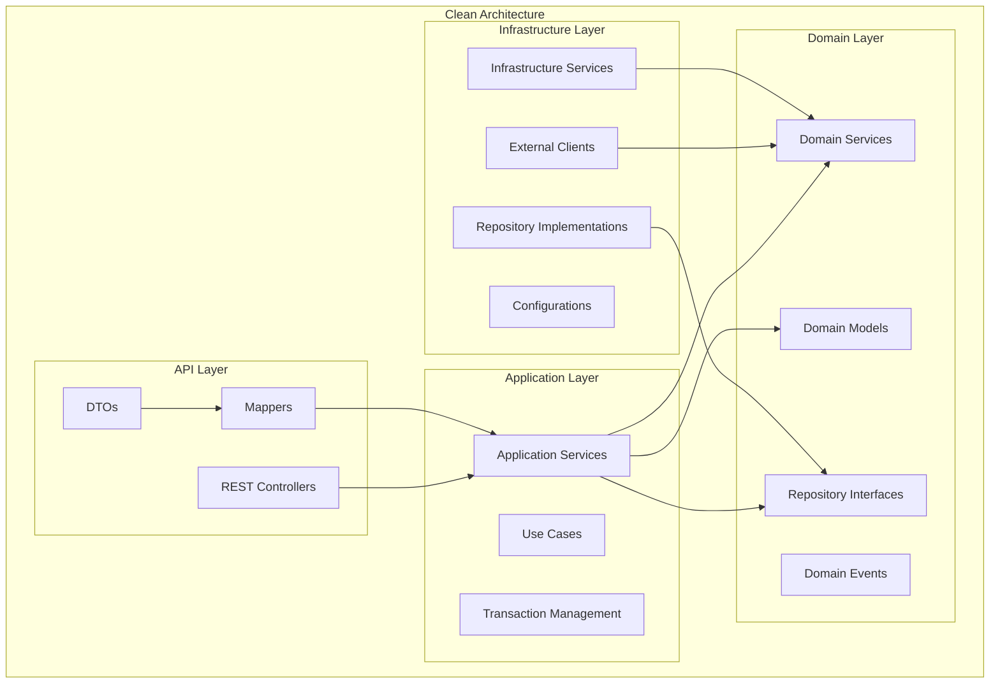
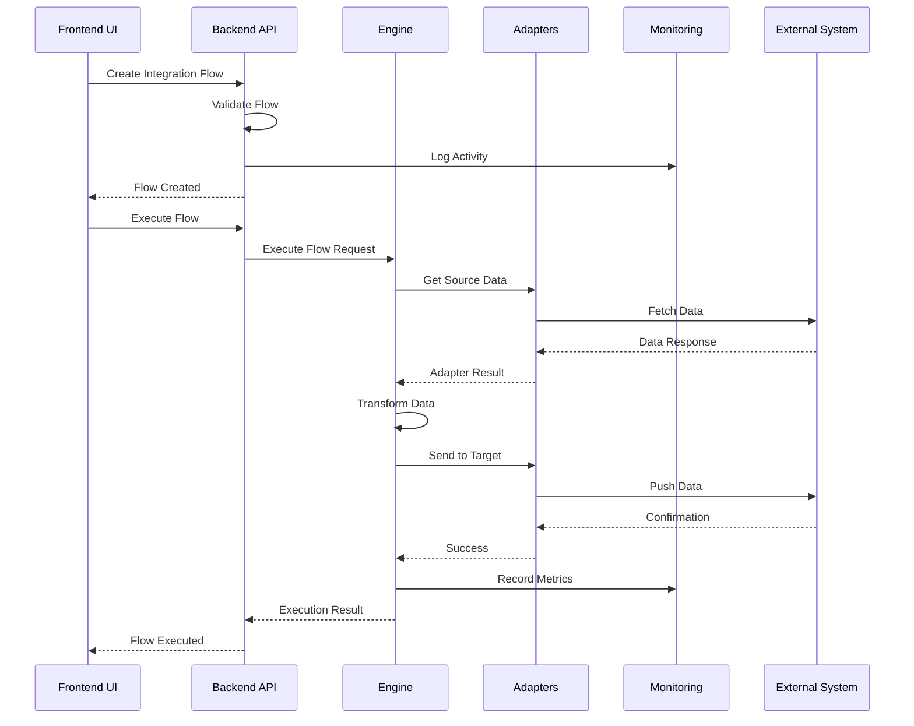
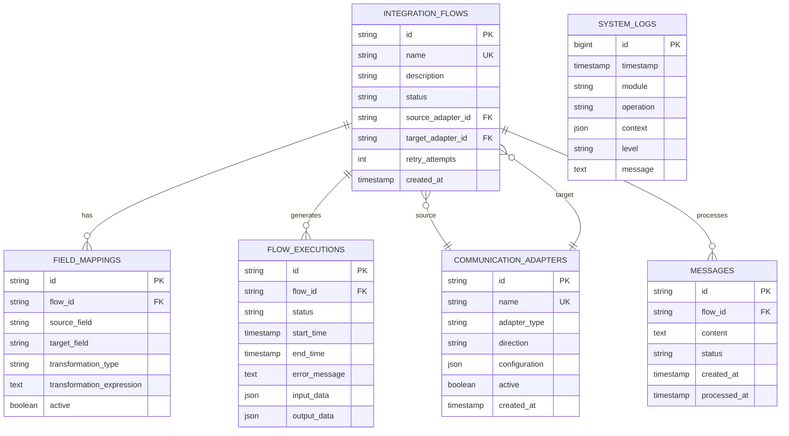
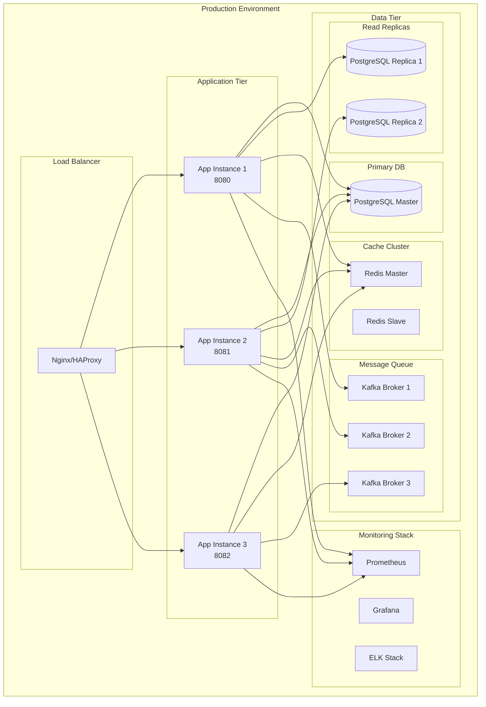
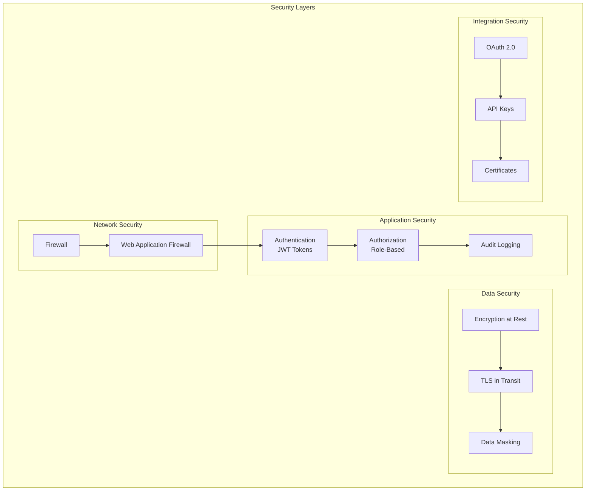
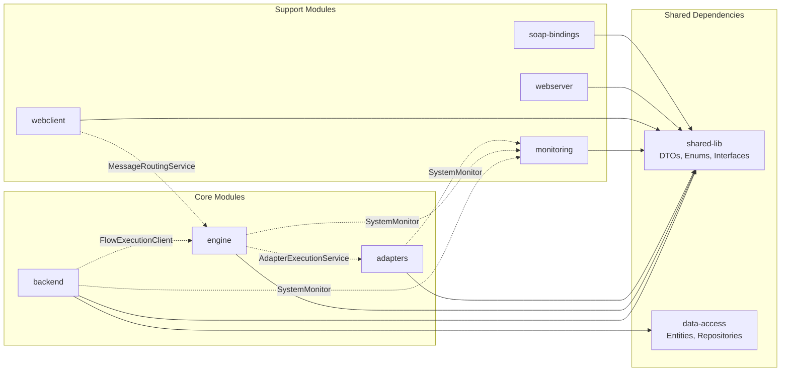
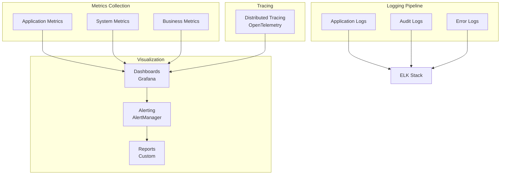

# Integrix Flow Bridge Architecture Diagrams

## System Overview

## Clean Architecture Layers

## Module Communication Flow

## Database Schema (Simplified)

## Deployment Architecture

## Security Architecture

## Module Dependency Graph

## Performance Optimization Points

```mermaid
graph TB
    subgraph "Caching Strategy"
        L1[Application Cache<br/>Caffeine]
        L2[Distributed Cache<br/>Redis]
        L3[Database Cache<br/>Query Results]
    end
    
    subgraph "Connection Pooling"
        DB_POOL[Database Pool<br/>HikariCP]
        HTTP_POOL[HTTP Pool<br/>Apache HttpClient]
        MQ_POOL[Message Queue Pool<br/>Kafka Producer Pool]
    end
    
    subgraph "Async Processing"
        ASYNC[Async Executors<br/>ThreadPoolTaskExecutor]
        REACTIVE[Reactive Streams<br/>Project Reactor]
        EVENT[Event-Driven<br/>Spring Events]
    end
    
    L1 --> L2
    L2 --> L3
    
    DB_POOL --> HTTP_POOL
    HTTP_POOL --> MQ_POOL
    
    ASYNC --> REACTIVE
    REACTIVE --> EVENT
```

## Monitoring and Observability

